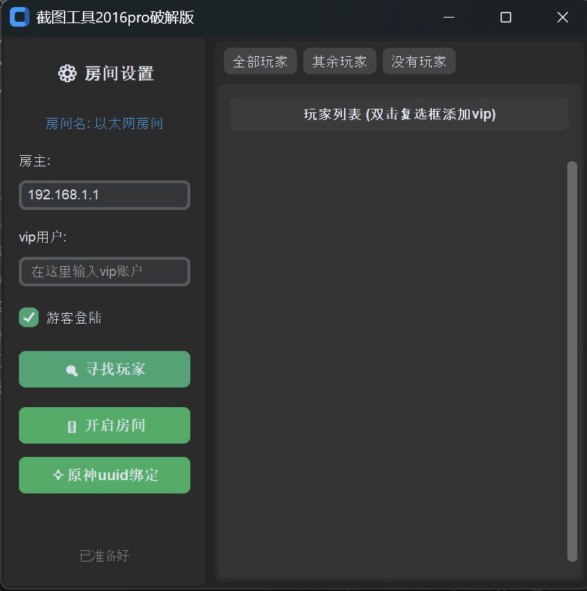

<div align="center">

# 🌐 ARP spoofing (MAC address tracking)

> 一款基于 Python 的局域网 ARP 工具，支持设备扫描、ARP 欺骗与 MAC 地址追踪绑定。提供桌面端（CustomTkinter）和 Web 端（Flask）双界面。

<p align="center">
  
  
  
  
</div>

<p align="right">
  <b>🇨🇳 中文</b> | <a href="README_EN.md">🇬🇧 English</a>
</p>

---

## 📑 目录

- [功能特性](#-功能特性)
- [项目结构](#-项目结构)
- [技术栈](#-技术栈)
- [环境要求](#-环境要求)
- [安装与运行](#-安装与运行)
- [使用说明](#-使用说明)
- [API 接口](#-api-接口)
- [打包为 EXE](#-打包为-exe)
- [截图预览](#-截图预览)
- [免责声明](#-免责声明)

---

## ✨ 功能特性

| 功能 | 说明 |
|:-----|:-----|
| 🔍 **ARP 局域网扫描** | 自动探测 `/24` 网段内所有存活主机，识别 IP 与 MAC 地址 |
| 🎯 **ARP 中间人欺骗** | 支持单向 / 双向 ARP 欺骗，可配置发包间隔 |
| 🛡️ **白名单机制** | VIP 用户、网关、本机自动排除，避免误伤 |
| 🔧 **ARP 缓存修复** | 攻击期间自动维护本机 ARP 表，保证自身网络正常 |
| 📌 **MAC 地址静态绑定** | 通过 `netsh` 将网关 MAC 绑定到本机 ARP 表 |
| 🖥️ **桌面端 + Web 端** | 两种界面可选，功能一致,web版本可以协同其他人一同管理 |
| 🎨 **现代暗色 UI** | 深色主题设计，支持响应式布局 |
| 👻 **隐身运行** | 程序支持后台`静默运行`(无程序托盘) |

---


> **注意**：项目界面使用了伪装命名（如"截图工具2016pro破解版"、"房间设置"、"寻找玩家"、"开启房间"等），将 ARP 扫描/欺骗操作包装为"玩家房间"的隐喻。

## 📁 项目结构

```
Arp/
├── main.py                  # 🖥️ 桌面端主程序入口
├── ArpIP.py                 # 🔧 MAC 地址绑定工具（独立模块）
├── Compile command.txt      # 📦 PyInstaller 打包命令
├── README.md                # 📄 项目说明文档
│
└── web_branch/
    ├── app.py               # 🌐 Web 端 Flask 后端
    ├── ArpIP.py             # 🔧 MAC 地址绑定工具（Web 分支副本）
    └── templates/
        └── index.html       # 🎨 Web 前端单页应用
```

---

## 🛠️ 技术栈

| 层级 | 技术 | 用途 |
|:-----|:-----|:-----|
| 网络层 | [Scapy](https://scapy.net/) | ARP 包构造、发送与嗅探 |
| 桌面 GUI | [CustomTkinter](https://github.com/TomSchimansky/CustomTkinter) | 现代化桌面界面 |
| Web 后端 | [Flask](https://flask.palletsprojects.com/) | RESTful API 服务 |
| Web 前端 | HTML + CSS + JavaScript | 单页应用，暗色主题 |
| 系统层 | winreg / netsh / ctypes | Windows 注册表与网络配置 |
| 打包 | [PyInstaller](https://pyinstaller.org/) | 打包为单文件 `.exe` |

---

## 📋 环境要求

- **操作系统**：Windows 10 / 11
- **Python**：3.8 或更高版本
- **Npcap**：[下载并安装 Npcap](https://npcap.com/#download)（Scapy 在 Windows 上的必要驱动）
- **管理员权限**：所有 ARP 操作需要以管理员身份运行

---

## 🚀 编译运行

### 1. 安装依赖

```bash
pip install scapy customtkinter flask
```

### 2. 运行桌面端

```bash
# 需要管理员权限
python main.py
```

### 3. 运行 Web 端

```bash
# 需要管理员权限
python web_branch/app.py
```

启动后自动打开浏览器访问 `http://127.0.0.1:9178`

---

## 📖 使用说明

### 桌面端

1. 以管理员身份启动 `main.py`，程序自动识别默认网关
2. 点击 **🔍 寻找玩家** 扫描局域网设备
3. 在列表中勾选目标设备（双击可添加/移除 VIP）
4. 点击 **🚪 开启房间** 启动 ARP 欺骗
5. 点击 **✧ 原神 uuid 绑定** 可打开 MAC 地址绑定工具,开启无敌模式

### Web 端

1. 以管理员身份启动 `python web_branch/app.py`
2. 浏览器自动打开控制面板
3. 左侧配置网关 IP、白名单、发包间隔等参数
4. 点击 **🔍 寻找玩家** 扫描局域网
5. 右侧列表中选择目标，点击 **🚪 开启房间**

> 💡 双击玩家条目可快速切换 VIP 状态

---

## 📡 API 接口

Web 端提供以下 RESTful API：

| 路由 | 方法 | 功能 |
|:-----|:-----|:-----|
| `GET /` | GET | 渲染主页面 |
| `POST /api/scan` | POST | ARP 扫描局域网设备 |
| `POST /api/control` | POST | 启动 / 停止攻击循环 |
| `POST /api/update_targets` | POST | 更新攻击目标列表 |
| `POST /api/update_whitelist` | POST | 更新白名单 |
| `POST /api/update_config` | POST | 更新配置（双向模式、发包间隔） |
| `GET /api/status` | GET | 查询运行状态与包计数 |
| `GET /api/state` | GET | 获取全量状态（前端轮询同步） |
| `POST /api/openlock` | POST | 启动 MAC 绑定工具 |
| `POST /api/quit` | POST | 强制终止后端进程 |

---

## 📦 打包为 EXE

使用 PyInstaller 打包为单文件可执行程序：

***安装`PyInstaller`:***
```bash
pip install pyInstaller
```

**桌面端：**

```bash
pyinstaller --clean --onefile -w -i ".\Banchen123.ico" --exclude-module numpy --exclude-module matplotlib  --exclude-module IPython --exclude-module pandas  ".\main.py"
```

**Web 端：**

```bash
pyinstaller --clean --onefile -w -i ".\Banchen123.ico" --uac-admin --add-data ".\web_branch\templates;templates"  --exclude-module numpy --exclude-module matplotlib  ".\web_branch\app.py"
```

---
## 📸 截图预览
> 桌面端和 Web 端均采用深色主题设计，界面简洁直观。

### Web 端截图
<center>


</center>

### 桌面端截图
<center>



</center>

---

## ⚠️ 免责声明与注意事项

1. 桌面端 在攻击运行中关闭窗口后仅隐藏窗口，如果你需要结束攻击,需手动从任务管理器结束程序进程
2. web端  对外暴露 HTTP 服务（端口 9178），绑定 `0.0.0.0`，局域网内其他主机可访问

本项目仅供**学习和研究**目的，用于理解 ARP 协议原理和网络安全知识。

- 请在**授权的网络环境**中使用本工具
- 未经许可对他人网络进行 ARP 欺骗属于**违法行为**
- 作者不对因使用本工具造成的任何损失或法律责任承担责任
- 使用本工具即表示您已阅读并同意上述条款

---

## 📄 许可证

本项目采用 [MIT License](LICENSE) 开源许可证。

---

<p align="center">
  如果觉得有用，请给个 ⭐ Star 支持一下！
</p>